<!--
  ╔══════════════════════════════════════════════════════════════════════╗
  ║  tugberkcem | GitHub Profile README                                  ║
  ║  Bu dosya projenin KOK dizinine README.md olarak konumlandirilir.    ║
  ║  SVG'ler ayni kok dizinde uretilir (scripts/ tarafindan).            ║
  ╚══════════════════════════════════════════════════════════════════════╝
-->

<code>tugberkcem@github ~ $ whoami</code>

<h3><code>&gt; Software Engineer · C++ · Python · Backend &amp; Embedded</code></h3>

  
  
  
  
  
  
  
  
  
  

 

<table>
<tr>
<td valign="top" width="38%">

<code>tugberkcem@github ~ $ cat ./portrait.svg</code>

</td>
<td valign="top" width="62%">

<code>tugberkcem@github ~ $ ./neofetch</code>

</td>
</tr>
</table>

 

<code>tugberkcem@github ~ $ git log --author="tugberkcem" --stat --graph</code>

 

## 👋 Merhaba, ben Tuğberk

C++, Python ve C dillerinde güçlü bir altyapıya sahip **yazılım mühendisiyim**. FastAPI, Flask ve Qt Framework ile uçtan uca uygulamalar tasarlayıp geliştiriyorum. Gömülü sistemler, ağ trafiği analizi, sinyal işleme ve MVC mimarisi üzerine stajlarımda edindiğim tecrübeyle karmaşık problemlere yenilikçi ve ölçeklenebilir çözümler üretiyorum.

Bitirme projem kapsamında geliştirdiğim mobil uygulamayı fikirden **App Store ve Google Play yayınına** kadar uçtan uca hayata geçirdim. Öğrenmeye açık, sorumluluk almaktan çekinmeyen ve ekip içinde üretken bir yazılım mühendisi olarak kariyerime devam etmek istiyorum.

 

## 🎓 Eğitim

**Kütahya Dumlupınar Üniversitesi** — Yazılım Mühendisliği (Lisans) · `2024 – 2026`
Karabük Üniversitesi'nden **yatay geçiş** ile kayıt oldu.
**Mezuniyet Ortalaması: 3.14 / 4.00**

**Karabük Üniversitesi** — Yazılım Mühendisliği (Lisans) · `2022 – 2024`

 

## 💼 Deneyim

### ECEMTAG Control Technologies — Stajyer Yazılım Mühendisi
`Temmuz 2025 – Eylül 2025 · İstanbul, Teknopark`

- C++ ve **Qt Framework** kullanarak **MVC mimarisi** standartlarında, gerçek zamanlı **Tank Motor Sesi Simülasyonu** ve **Diagnostic Tool** arayüzleri geliştirdim.
- **Qt Multimedia** ile WAV dosyası işleme, RPM–Pitch (hız/frekans) eşleştirme, clipping koruması ve mono–stereo dönüşüm algoritmalarını entegre ettim.
- ECEMTAG PLM System üzerinde test senaryoları (Test Case) oluşturarak hata yönetimi (debug) ve birim test süreçlerini aktif olarak yürüttüm.
- **Agile/Scrum** metodolojisiyle yürütülen sprint döngülerinde görev takibi yaparak ekip içi geliştirme süreçlerine katkıda bulundum.

### Andasis Elektronik ve Ticaret A.Ş. — Stajyer Yazılım Mühendisi
`Ağustos 2024 – Eylül 2024 · İstanbul, Teknopark`

- **OpenWrt** sistemlerinde `vnstat`, `iftop` ve `collectd` araçlarını kullanarak ağ arayüzlerindeki veri trafiğini ve bant genişliğini gerçek zamanlı izleyen bir altyapı kurdum.
- Sistem performansını (CPU, bellek, sistem yükü) **LuCI** arayüzü üzerinden grafiksel olarak analiz ettim.
- ICMP paket kayıpları ve ağ gecikmeleri (ping/RTT) üzerine hata tespiti ve raporlama süreçlerini yürüttüm.

 

## 🚀 Öne Çıkan Projeler

### 📱 PetMate Assistant — Mobil Uygulama & Mağaza Optimizasyonu
`Bitirme Projesi · Haziran 2026 · App Store & Google Play'de YAYINDA`

Kullanıcı arayüzü (UI) kartlarını tasarladığım ve yerelleştirilmiş fiyatlandırma yapılarını entegre ettiğim mobil uygulama. Cihaza özel ekran görüntüleri ve mağaza varlıkları hazırlanarak uçtan uca yayın süreci tamamlandı; uygulama şu anda **App Store ve Google Play Store'da aktif olarak yayında**.

### 🩺 CoMedic — Klinik Karar Destek Sistemi
Hastalardan alınan klinik verileri değerlendirerek hekimlere tanı ve tedavi sürecinde öneriler sunan karar destek yazılımı. **C++ ve Qt Framework** ile masaüstü kullanıcı arayüzünü tasarladım; arka planda **FastAPI** ile veri işleme ve kural motoru mantığını yönettim. Projenin teknik dokümantasyonlarını hazırlayarak backend dizin hiyerarşisini sürdürülebilir bir yapıya kavuşturdum.

### 🐾 Hayvan Sahiplendirme Web Platformu
**Python ve Flask** ile geliştirdiğim, otomatik **WhatsApp entegrasyonuyla** ilan sahibi ile sahiplenmek isteyenleri anlık buluşturan web platformu.

### 🎛️ Sinyal İşleme (DSP) ile Ses Filtreleme
**Python** ile 3500 Hz yüksek, 2500 Hz alçak ve 2000–3000 Hz bant geçiren filtreler tasarlayarak ses sinyallerinin zaman-frekans analizini gerçekleştirdim.

 

## 🛠️ Teknik Yetenekler

| Kategori | Teknolojiler |
|---|---|
| **Programlama Dilleri** | Python, C++, C, SQL |
| **Framework & Kütüphaneler** | Qt Framework, PyQt, Flutter, FastAPI, Flask, Qt Multimedia, NumPy, SciPy |
| **Veritabanı & Modelleme** | MongoDB, İlişkisel Veritabanı Tasarımı (ERD) |
| **Sistem & Araçlar** | Git/GitHub, Linux/Unix, OpenWrt, VnStat, Iftop, Collectd, SSH, LuCI, Arduino |
| **Metodoloji & Mimari** | Agile/Scrum, OOP, MVC Mimarisi |
| **Gömülü Sistemler** | STM32, Arduino, ARM Cortex-M |
| **Diller** | Türkçe (Anadil), İngilizce (B1 – Orta Düzey) |

 

## 📫 Benimle İletişime Geç

  

<i>Bu profildeki ASCII portre, Neofetch kartı ve katkı ısı haritası; hiçbir üçüncü parti servise bağımlı olmadan yalnızca Python ve SVG/SMIL ile üretilmektedir.</i>

